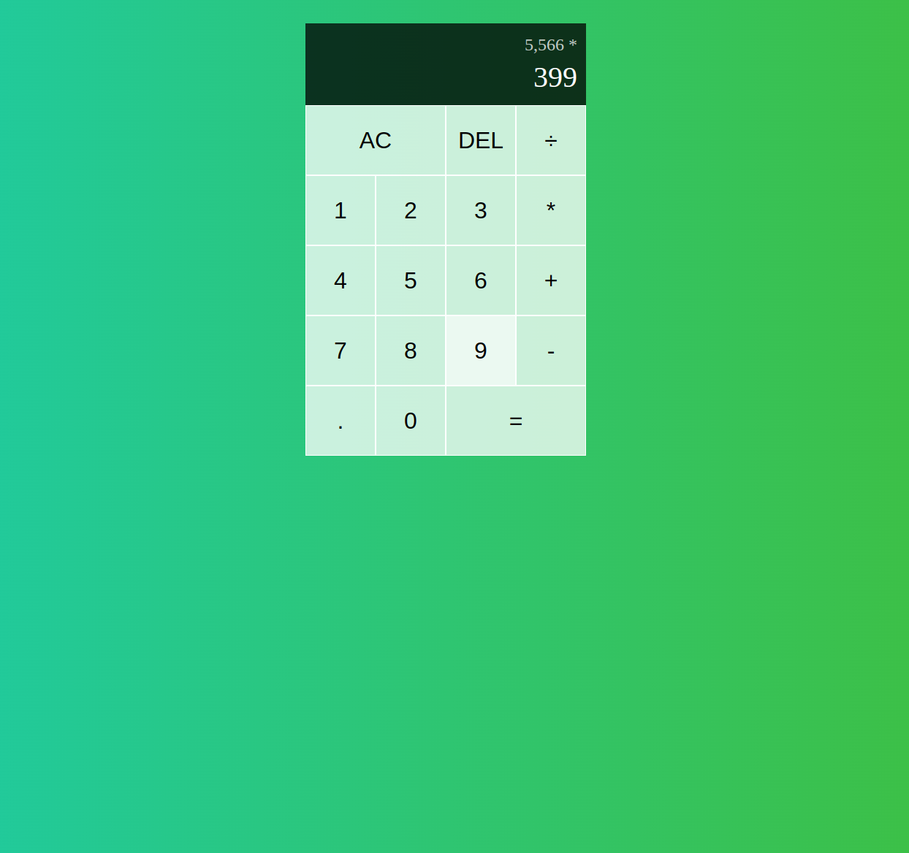

# React Calculator App

A simple and intuitive calculator application built with React. This project implements calculator logic manually without relying on external libraries for computations, providing a clean and hands-on understanding of React and JavaScript fundamentals.

## Table of Contents

-   [Overview](#overview)
-   [Features](#features)
-   [Technologies Used](#technologies-used)
-   [Best Practices](#best-practices)
-   [Installation](#installation)
-   [Usage](#usage)
-   [How It Works](#how-it-works)
-   [Screenshots](#screenshots)
-   [License](#license)
-   [Contact](#contact)

----------

## Overview

This React-based calculator allows users to perform basic arithmetic operations (addition, subtraction, multiplication, and division) with a clean and responsive interface. The app is developed from scratch, with all calculation logic implemented manually to demonstrate mastery of React state management and JavaScript.

## Features

-   Basic arithmetic operations: addition, subtraction, multiplication, division.
-   Clear and delete functionality.
-   Real-time formatting of numbers for better readability.
-   Responsive design suitable for different devices.
-   Developed without using external libraries for calculations.

----------

## Technologies Used

-   **React.js**: For building the user interface and managing state.
-   **CSS**: For styling the application.
-   **JavaScript**: For implementing logic manually.

----------

## Best Practices

-   **State Management**: The app uses React's `useReducer` hook to handle application state effectively.
-   **Component Reusability**: Separate `DigitButton` and `OperationButton` components improve modularity and reusability.
-   **Formatting and Validation**: Input validation and formatting enhance user experience by preventing invalid operations.

----------

## Installation

To run this project locally:

1.  **Clone the repository**:
    
    `git clone https://github.com/kuriakosant/react-calculator-app
    cd react-calculator-app` 
    
2.  **Install dependencies**:
    
    `npm install` 
    
3.  **Start the development server**:
    
    `npm start` 
    
4.  Open your browser and navigate to `http://localhost:3000`.
    

----------

## Usage

1.  Clone and install the app as described in the installation guide.
2.  Use the number buttons to input digits.
3.  Select an operation (`+`, `-`, `*`, `÷`).
4.  Press `=` to evaluate the expression.
5.  Use `AC` to clear the screen or `DEL` to delete the last digit.

----------

## How It Works

This calculator implements core arithmetic logic manually:

1.  **State Management**:
    
    -   The app maintains the current and previous operands and the chosen operation in its state.
    -   `useReducer` is used to manage complex state transitions based on user actions.
2.  **User Actions**:
    
    -   Digits and operations are dispatched as actions to the reducer.
    -   The reducer updates the state based on action types (`ADD_DIGIT`, `CHOOSE_OPERATION`, `EVALUATE`, `CLEAR`, etc.).
3.  **Calculation Logic**:
    
    -   Operations are evaluated by the `evaluate` function, which parses operands as floating-point numbers and performs the operation.
    -   Input validation prevents invalid operations, like dividing by zero or multiple decimals in a number.
4.  **Number Formatting**:
    
    -   Numbers are formatted using `Intl.NumberFormat` for improved readability.

----------
## Screenshots

### Calculator Interface

----------

## License

This project is licensed under the MIT License. See the [LICENSE](LICENSE) file for details.

----------

## Contact

For questions or collaboration:

-   **Name**: [Kyriakos Antoniadis]
-   **Email**: kuriakosant2003@gmail.com
-   **GitHub**: [kuriakosant](https://github.com/kuriakosant)
-   **LinkedIn**: [Kyriakos Antoniadis](https://www.linkedin.com/in/kyriakos-antoniadis-288444326/)

Feel free to reach out with any questions or suggestions!

----------
